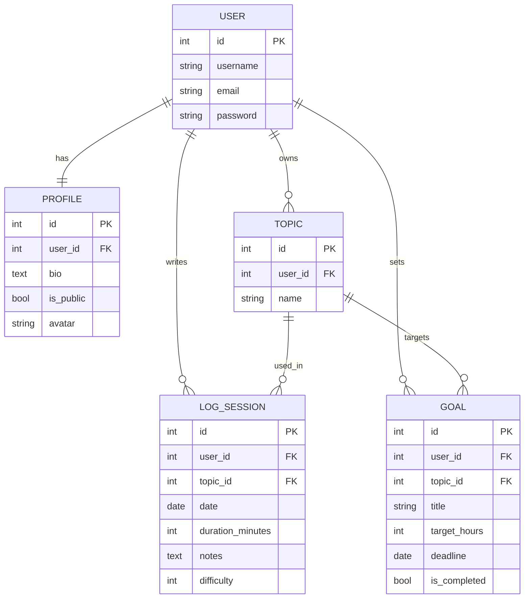

## Database Schema




# DevLog

DevLog is a Django web application for tracking developer learning progress.

Users can create topics, log study sessions, set learning goals, and view progress statistics on a dashboard. The app also includes public developer profiles, so users can share their learning activity, goals, and recent sessions as a portfolio signal.

## Features

- User registration, login, logout, and profile settings
- Study topics management
- Study session CRUD
- Learning goals with progress tracking
- Dashboard with total sessions, minutes, hours, and topic statistics
- Public profile page with learning stats
- Responsive dark UI
- Avatar upload support

## Tech Stack

- Python
- Django
- SQLite
- HTML / CSS

## Local Setup

1. Clone the repository:

```bash
git clone https://github.com/antar1x/devlog.git
cd devlog
```

2. Create and activate a virtual environment:

```bash
python -m venv .venv
```

On Windows:

```bash
.venv\Scripts\activate
```

On macOS/Linux:

```bash
source .venv/bin/activate
```

3. Install dependencies:

```bash
pip install -r requirements.txt
```

4. Apply database migrations:

```bash
python manage.py migrate
```

5. Create an admin user:

```bash
python manage.py createsuperuser
```

6. Run the development server:

```bash
python manage.py runserver
```

Open `http://127.0.0.1:8000/` in your browser.

## Checks

Run tests:

```bash
python manage.py test
```

Run flake8:

```bash
python -m flake8 .
```

## Deployment

This project is prepared for deployment on Render.

Required environment variables:

- `SECRET_KEY`
- `DATABASE_URL`
- `RENDER_EXTERNAL_HOSTNAME` is provided automatically by Render

Render settings:

- Build command: `bash build.sh`
- Start command: `python -m gunicorn DevLog.asgi:application -k uvicorn.workers.UvicornWorker`

The `build.sh` script installs dependencies, collects static files, and runs
database migrations. The `render.yaml` file can also be used to deploy the app
as a Render Blueprint.
