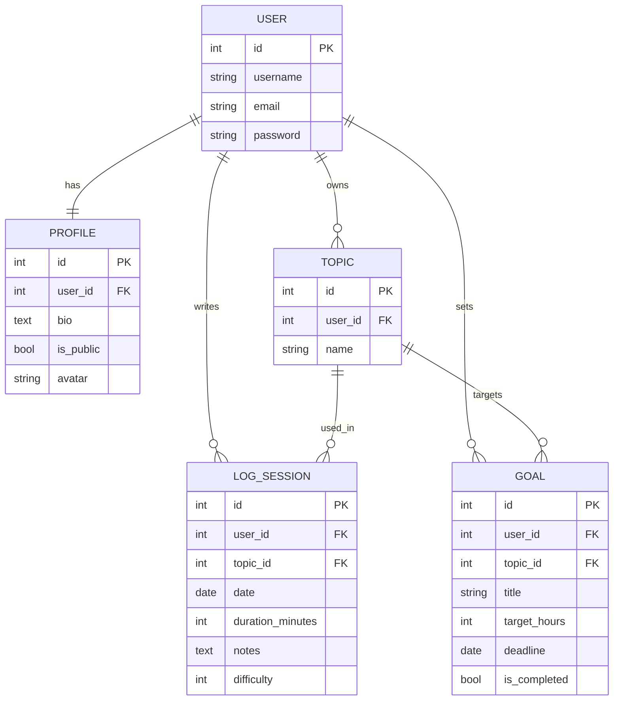

## Database Schema

# DevLog

DevLog is a Django web application for tracking developer learning progress.

Users can create topics, log study sessions, set learning goals, and view progress statistics on a dashboard. The app also includes public developer profiles, so users can share their learning activity, goals, and recent sessions as a portfolio signal.

## Features

- User registration, login, logout, and profile settings
- Study topics management
- Study session CRUD
- Learning goals with progress tracking
- Dashboard with total sessions, minutes, hours, and topic statistics
- Public profile page with learning stats
- Responsive dark UI
- Avatar upload support

## Tech Stack

- Python
- Django
- SQLite
- HTML / CSS